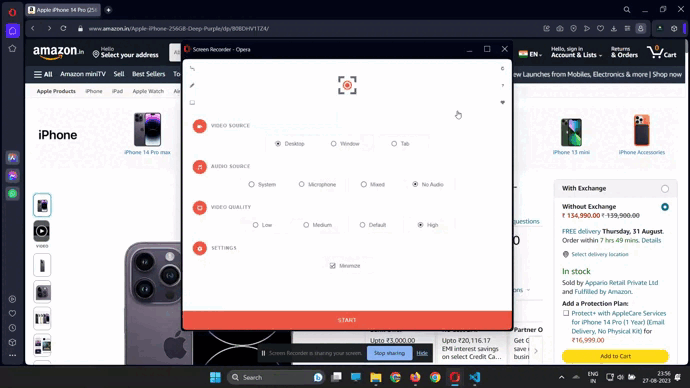

# SpendSmart
Designed a browser extension aimed at enhancing spending decisions through informed choices. Leveraged user input, enabling insights into earnings-to-amount conversion. Implemented a feature-rich experience by offering alternative product suggestions for improved value using OpenAI’s ChatGPT API.

### Download

cxr : https://github.com/Alik-Kumar-Ghosh/SpendSmart/releases/tag/CRX_Release


---

 
### Using OpenAI API

<a href="https://platform.openai.com/account/api-keys">https://platform.openai.com/account/api-keys</a> <br>


Replace 'Your API key' with your secret API key here
```javascript
var Open_AI_API_key = 'Your API Key'
```
```javascript
headers: {
  'Content-Type': 'application/json',
  'Authorization': 'Bearer Open_AI_API_key'
  },
```

---
 
 
 ### Architecture diagram 

 </img>
 
---

 ### ScreenCast

</img>

---
 ### License
 
 © Alik Kumar Ghosh, SpendSmart is licensed under the GNU General Public License v3.0 [License]()


